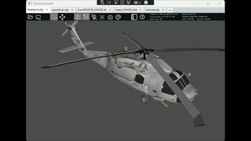
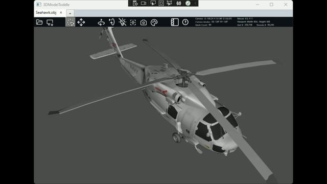
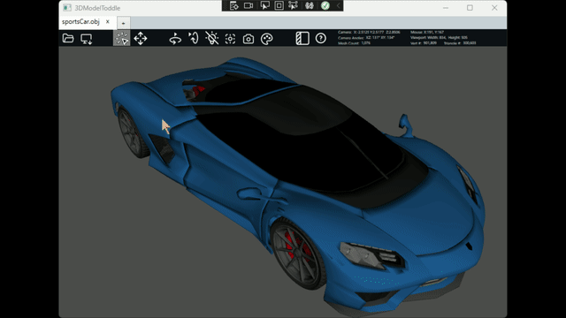
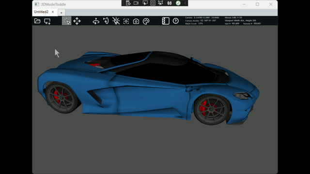

# 3DModelToddle
  
* 3D model loader and manipulator written in C#.  
* Supported formats .obj, .stl(no textures), and .X3D(no textures).

## Image Credits
This project uses images from the [Tabler Icons repository](https://github.com/tabler/tabler-icons). The images are licensed under the MIT License.

---
## Mesh TreeView Selection
* The model hierarchy is displayed in a tree view, allowing you to explore the structure.  
* Selecting an item in the tree highlights the corresponding mesh in the 3D model, and vice versa.  

  

---
## Mesh Multiple Selection
* Select multiple meshes by holding down the Shift or Ctrl key while clicking.  
* Clicking a mesh makes it temporarily transparent.  

  

---
## Mesh Move & Rotate
* Move meshes by selecting the 'Move' tool, clicking on a mesh, and dragging along the highlighted axis.  
* To rotate a mesh, select it, right-click, and choose a rotation option from the context menu.  

  

